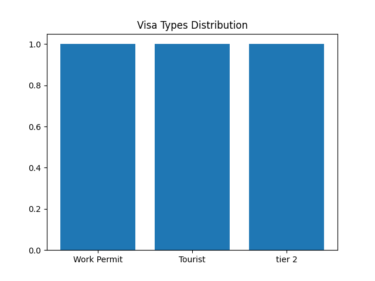

# 🛂 VisaFlow - Smart Visa Application Tracker

VisaFlow is a powerful, open-source visa tracking and analytics platform built with Django and React principles in mind. It allows users to manage, track, visualize, and export visa application data through a modern, secure, and fully responsive interface.

---

## 🚀 Features

✅ Submit and manage visa applications  
✅ Export visa data to **PDF** and **CSV** formats  
✅ Beautiful and interactive **Dashboard Chart** (Matplotlib)  
✅ **Login/Logout** system (Django Auth)  
✅ RESTful **API with Swagger UI & Redoc**  
✅ **Unit tests** for all main views  
✅ **Bootstrap 5** responsive design  
✅ Built-in **admin panel**  
✅ Completely **open-source** and customizable

---

## 🧰 Tech Stack

- **Backend:** Django 5.2.3, Django REST Framework  
- **Frontend:** Bootstrap 5 (server-side rendering with Django templates)  
- **Database:** SQLite (dev) – ready for PostgreSQL  
- **API Docs:** drf-yasg (Swagger + Redoc)  
- **PDF Generator:** ReportLab  
- **Charting:** Matplotlib  
- **Authentication:** Django built-in auth

---

## 📂 Project Structure

```bash
VisaFlow/
├── core/                 # App for main logic (views, models, urls, forms)
│   ├── templates/        # HTML templates with Bootstrap 5
│   ├── static/           # Static files (Bootstrap, chart.png)
│   └── ...
├── visa_tracker/         # Django project settings and URLs
├── tests/                # Unit tests
├── db.sqlite3            # SQLite database
├── requirements.txt      # Dependencies
├── README.md             # This file
└── manage.py             # Django CLI entrypoint
```

---

## 📊 Dashboard Preview

The dashboard visualizes the distribution of visa types:



---

## 🔐 Authentication

VisaFlow provides secure login/logout functionality. Only authenticated users can:
- Submit new applications
- View/export visa data
- Access the dashboard
- Use the API

---

## 🔌 API Documentation

Once the server is running, visit:

- Swagger: [`/swagger/`](http://127.0.0.1:8000/swagger/)
- Redoc: [`/redoc/`](http://127.0.0.1:8000/redoc/)
- API Root: [`/api/`](http://127.0.0.1:8000/api/)

---

## ✅ Running the Project

```bash
# 1. Create virtual environment
python -m venv venv
source venv/Scripts/activate  # On Windows

# 2. Install dependencies
pip install -r requirements.txt

# 3. Migrate and create superuser
python manage.py migrate
python manage.py createsuperuser

# 4. Run the server
python manage.py runserver
```

---

## 🧪 Run Unit Tests

```bash
python manage.py test
```

---

## 📦 Export

- Export PDF: [`/export/pdf/`](http://127.0.0.1:8000/export/pdf/)
- Export CSV: [`/export/csv/`](http://127.0.0.1:8000/export/csv/)

---

## 💼 Ideal For

- Visa consultancies  
- Global mobility & HR departments  
- International students or expats  
- Showcasing **Global Talent Visa** eligibility  
- Professional Django portfolios (GitHub, CV, LinkedIn)

---

## 📄 License

This project is licensed under the MIT License.

---

## 🌐 Author

Developed by [Mohammadali Estakhr](https://www.linkedin.com/in/mohammadali-estakhr) 🇬🇧  
Feel free to fork, star, or contribute!

---

⭐️ If you found this project useful, give it a star on GitHub!
